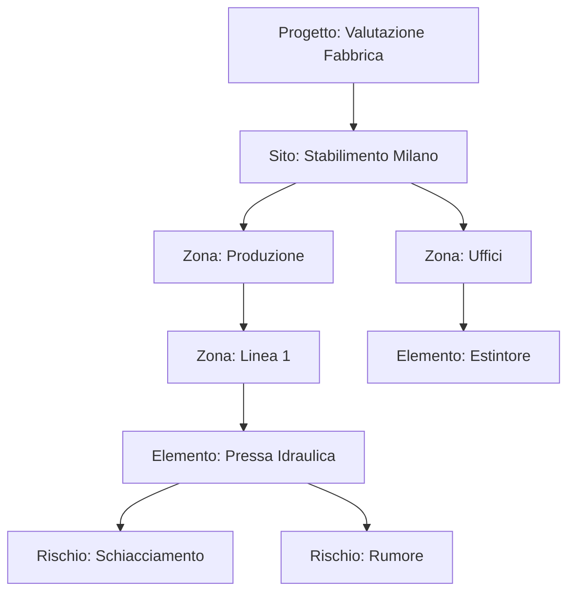

# Architettura del Software per la Valutazione dei Rischi

Questo documento definisce la struttura logica (il "Modello Dati") del nostro software. Prima di scrivere codice, è fondamentale decidere come rappresentare la realtà (case, fabbriche) in termini informatici.

## La Gerarchia (Struttura, Sottostruttura, Elemento)

Per adattarci a qualsiasi cliente (da una piccola casa a una grande fabbrica), useremo un modello **Gerarchico** e **Modulare**. Questo è un concetto chiave nell'ingegneria del software chiamato *Composition Pattern* (Pattern Composito).

Immagina la struttura come un albero:

1.  **Project/Assessment (Progetto/Valutazione)**
    *   È il contenitore principale. Esempio: "Valutazione Sicurezza Casa Rossi" o "Analisi Fabbrica XYZ".

2.  **Site (Sito/Struttura Principale)**
    *   Rappresenta l'edificio o il complesso intero.
    *   *Proprietà*: Indirizzo, Tipo (Residenziale, Industriale), Coordinate GPS.

3.  **Zone (Zona/Sottostruttura)**
    *   Questa è la parte flessibile. Una zona può contenere altre zone.
    *   Esempio 1 (Casa): Piano Terra -> Cucina.
    *   Esempio 2 (Fabbrica): Capannone A -> Reparto Saldatura.
    *   *Nota*: In informatica, questo permette "ricorsione" (una zona dentro una zona dentro una zona...).

4.  **Asset/Element (Elemento Fisico)**
    *   L'oggetto reale da ispezionare che si trova in una Zona.
    *   Esempio: "Quadro Elettrico", "Scala Principale", "Macchinario CNC", "Finestra".

5.  **Risk Factor (Fattore di Rischio)**
    *   Collegato all'Elemento.
    *   Contiene: Probabilità, Danno, Livello di Rischio, Note, Foto.

## Diagramma Logico

## Prossimi Passi per l'Implementazione

Per costruire questo, useremo una programmazione **Orientata agli Oggetti (OOP)** o a **Componenti** (se Web).

1.  **Definizione Classi/Tipi**: Creeremo il codice che definisce cosa è un "Sito" e cosa è una "Zona".
2.  **Interfaccia Utente (UI)**: Creeremo una visualizzazione ad albero (Tree View) per navigare tra le strutture.
3.  **Logica di Calcolo**: Il "Motore" che calcola il rischio totale (R = P x D).
